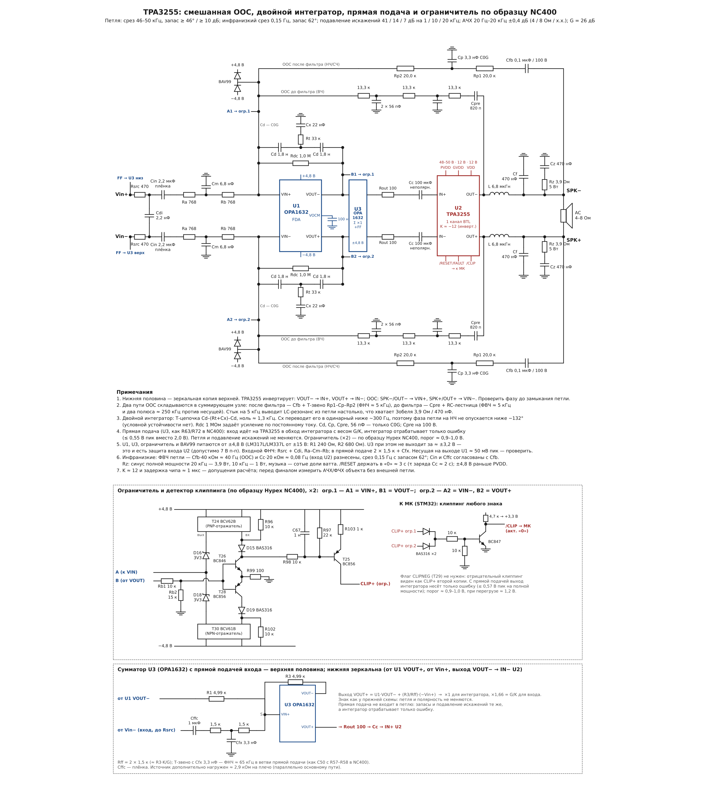

# TPA325x — внешняя обратная связь для TPA3255

Расчёт и схемы внешней петли ООС вокруг TPA3255 (один канал BTL) на дифференциальном
интеграторе OPA1632. Четыре варианта:

| | Только после фильтра (PFFB) | Смешанная ООС | Смешанная ООС + двойной интегратор + ограничитель NC400 | **То же + прямая подача входа** |
|---|---|---|---|---|
| Схема | [PDF](docs/pffb/pffb_schematic.pdf) | [PDF](docs/blended/tpa3255_blend_schematic.pdf) | [PDF](docs/double-clamp/tpa3255_dbl_clamp_schematic.pdf) | [**PDF**](docs/feedforward/tpa3255_ff_schematic.pdf) |
| Диаграммы Боде | [PNG](docs/pffb/pffb_bode.png) | [PNG](docs/blended/pffb_blend_bode.png) | [PNG](docs/double-clamp/double_blend_bode.png) | петля та же, что в соседнем столбце |
| Срез петли | 22–34 кГц | 33–39 кГц | 40–43 кГц | 46–50 кГц |
| Запас по фазе / усилению | ≥ 67° / ≥ 9,3 дБ | ≥ 52° / ≥ 12,1 дБ | ≥ 48° / ≥ 10,8 дБ | ≥ 46° / ≥ 10 дБ |
| Глубина ООС 1к / 5к / 10к / 20к | 26 / 12 / 7 / 1–2,5 дБ | 33 / 19–20 / 13–14 / 5–7 дБ | 41 / 21 / 14–15 / 6–9 дБ | **41 / 21 / 14 / 7–8 дБ** |
| АЧХ 20 Гц–20 кГц (4 Ом / 8 Ом / х.х.) | −2,3…0 дБ | −0,7…+0,7 дБ | −0,7…+0,7 дБ | **−0,4…+0,4 дБ** |
| Размах выхода интегратора на полной мощности | 2,05 В | 2,05 В | 2,05 В | **≤ 0,55 В** (только ошибка) |
| Защита входа U2 при клиппинге | диоды после Rout | диоды после Rout | активный ограничитель + флаг /CLIP | активный ограничитель (порог ≈ 1 В) + питание U3 ±4,8 В (вход чипа ≤ ≈ ±3,2 В) + флаг /CLIP |

Рекомендуемый вариант — **смешанная ООС с двойным интегратором, ограничителем и прямой подачей входа** (`docs/feedforward/`).
Вариант без прямой подачи (`docs/double-clamp/`) на одну микросхему проще; по подавлению искажений они одинаковы.

## Исправления после ревью (в рекомендуемом варианте)

1. **Инфранизкий резонанс ≈ 0,1 Гц.** В петле стояли два разделительных конденсатора — Cfb 1 мкФ в ООС
   (≈ 4 Гц с 40 кОм) и Cc 10 мкФ на входе TPA3255 (≈ 0,8 Гц с его 20 кОм). Вместе с усилением петли ~50 дБ
   на НЧ они давали срез петли на 0,104 Гц с запасом по фазе 9° и пиком АЧХ +17 дБ (`sim/lf_check.py`).
   Исправлено разнесением постоянных времени: **Cfb 0,1 мкФ** (≈ 40 Гц), **Cc 100 мкФ неполярный** (≈ 0,08 Гц,
   внутри петли, его нелинейность подавляется ООС); Cin 2,2 мкФ и Cffc 1 мкФ согласованы с Cfb.
   Срез 0,15 Гц, запас 62°, АЧХ ниже 20 Гц не выше +0,65 дБ, Rdc 1 МОм и глубина ООС на басу сохранены.
   Вариант без Cfb (ООС по постоянному току с компенсацией PVDD/2 на −15 В) отвергнут: смещение TPA3255 и
   разбаланс резисторов оседали бы на выходе интегратора ×25 и включали бы ограничитель.
2. **Нагрев Зобеля.** 3,3 Ом / 2,2 мкФ рассеивал 41 Вт на синусе полной мощности 20 кГц. Стык путей ООС
   перенесён с 10,6 до **5 кГц** (Cp 3,3 нФ, Cpre 820 пФ) — LC-резонанс сильнее выпадает из петли, и хватает
   **Зобеля 3,9 Ом / 470 нФ**: 3,9 Вт на 20 кГц, 1 Вт на 10 кГц, на музыке сотые доли ватта
   (`sim/zobel_blend.py`). Входная коррекция пересчитана: Cdi 2,2 нФ, Cm 6,8 нФ.
3. **Полярность и ограничитель** перепроверены: TPA3255 инвертирует, VOUT− → IN+, VOUT+ → IN−; знак прямой
   подачи (Vin− → узел VIN+ U3) и включение ограничителя (B1 = VOUT−, A1 = VIN+) дают отрицательную обратную
   связь. Ограничитель поперёк интегратора (стабилитроны) давно заменён схемой по образцу NC400 и питанием ±4,8 В.
   Фазу всё равно проверить на плате до замыкания петли.

   Знаки по кругу петли (верхняя половина): U1 VIN+ → VOUT− **(−)** → U3 VIN+ → VOUT+ **(+)** → TPA3255 IN+ →
   синфазный ему выход (обозначен OUT−; у инвертирующего чипа это не «свой» выход) **(+)** → фильтр → SPK− → ООС
   в VIN+ U1 **(+)**: итог **−**, обратная связь отрицательная, а усилитель в целом неинвертирующий. Прямая подача в
   верхний узел U3 идёт с **Vin−** (перекрёстно), как и ветвь ограничителя: B1 = VOUT−, A1 = VIN+.
   Какой физический вывод TPA3255 (OUT_A или OUT_B) синфазен с выбранным входом — проверить на плате при
   разомкнутой петле: подать сигнал на вход чипа и посмотреть, какой выход идёт в фазе.

Итог по полной модели (`sim/final_check.py`): срез 46–50 кГц, запас ≥ 46° / ≥ 10 дБ на 4 / 8 Ом и холостом
ходу, АЧХ 20 Гц–20 кГц ±0,4 дБ, подавление искажений 41 / 14 / 7–8 дБ на 1 / 10 / 20 кГц.

> Варианты `pffb`, `blended`, `double-clamp` оставлены для истории и **содержат тот же инфранизкий резонанс**
> (Cfb 1 мкФ + Cc 10 мкФ). Для сборки — только `docs/feedforward/`.

## Прямая подача входа (feed-forward, как R63/R72 в NC400)

В NC400 вход через R63/R72 идёт прямо на вход компаратора модулятора, минуя интегратор U1A, а интегратор
добавляет только поправку ошибки. У нас то же сделано суммирующим FDA **U3** (второй OPA1632) между
интегратором U1 и TPA3255:

- U3.VOUT+ = U1.VOUT− (через R1 = R3 = 4,99 кОм, ×1) + вход с весом G/K ≈ 1,66 (Rff = 2 × 1,5 кОм от Vin−).
  Знак и полярность петли прежние;
- ветвь прямой подачи берётся прямо со входа (как R63 — до R57 в NC400), с развязкой Cffc 10 мкФ и
  Т-звеном 2 × 1,5 к + Cfx 3,3 нФ (ФНЧ ≈ 65 кГц);
- петля, запасы и подавление искажений **не меняются**: прямая подача в петлю не входит;
- выход интегратора несёт только ошибку: ≤ 0,55 В пик на полной мощности в звуковой полосе (было 2,0 В),
  поэтому порог ограничителя поднят с запасом — делитель 10 к / 15 к, порог ≈ 0,9–1,0 В даже при +40 °C,
  и флаг /CLIP срабатывает на настоящую потерю управления, а не на большой сигнал;
- ветвь прямой подачи сама не ограничена (с ЦАП 2 Vrms вход TPA3255 при клиппинге дошёл бы до ≈ 3,6 В).
  Вместо диодного ограничителя вся малосигнальная часть (U1, U3, ограничитель NC400, BAV99) питается от
  **±4,8 В** (LM317L/LM337L от ±15 В, R1 = 240 Ом, R2 = 680 Ом). OPA1632 не доходит до шин ~1,6 В
  (даташит, нагрузка 2 кОм), поэтому U3 сам не выходит за ≈ ±3,2 В — вход TPA3255 в пределах 7 В п-п,
  а рабочим 2,0 В остаётся запас ~1,2 В. Rout снова 100 Ом;
- входная коррекция пересчитана: Cdi 6,8 нФ, Cm 3,3 нФ.

### Входная цепь U1A в NC400 (R57, R58, R74, R75, R64, C50)

Это ФНЧ только в сигнальном пути интегратора (не в петле): Т-звено 1,2 к – (C50 2,2 нФ + R64 47 Ом,
дифференциально) – 1,2 к в суммирующий узел. Срез ≈ 58 кГц (−0,5 дБ и −18° на 20 кГц). R64 ограничивает
ослабление на ВЧ примерно −28 дБ и возвращает фазу к нулю выше нескольких МГц. На устойчивость петли цепь
не влияет — она формирует АЧХ/ФЧХ сквозного усиления и срезает ультразвук на входе. У нас её аналог —
Rsrc + Cdi и Ra–Cm–Rb; в ветви прямой подачи — 2 × 1,5 к + Cfx.

## Двойной интегратор и ограничитель по образцу Hypex NC400

Идея взята из входного каскада Hypex NC400 (модуль внутри NAD M22): там интегратор второго порядка
на одном NE5532 (Т-цепочки, соединённые серединами через R65) защищён активным ограничителем
T24/T26/T28/T30 с детектором клиппинга.

**Интегратор.** Вместо одинарного Ci — Т-цепочка Cd 1,8 нФ – (Rt 33 кОм + Cx 22 нФ на землю) – Cd 1,8 нФ
и Rdc 1,0 МОм поперёк. Ноль ≈ 1,3 кГц: выше него интегратор одинарный (эквивалент 0,9 нФ, на ВЧ
петля как у варианта с Ci = 1 нФ), ниже — второго порядка (+8 дБ глубины ООС на 1 кГц).
Cx возвращает его в одинарный ниже ~300 Гц, поэтому фаза петли на НЧ не опускается ниже −132°:
условной устойчивости нет, а резонанс с Rdc (проблема «голого» двойного интегратора) не возникает.

**Ограничитель** (две копии: A1 = VIN+, B1 = VOUT−; A2 = VIN−, B2 = VOUT+):
- выход интегратора через делитель 10 кОм / 3,0 кОм подаётся на базы T26 (NPN) / T28 (PNP)
  с эмиттерами на землю через 100 Ом;
- выше порога (≈ 2,3–2,4 В на плече) ток транзистора через отражатель BCV62/BCV61 и стабилитрон 3,3 В
  впрыскивается в суммирующий узел и не даёт интегратору накрутиться;
- R96/R102 10 кОм шунтируют вход отражателя (токи до ~60 мкА не проходят) — порог чёткий;
- в покое суммирующий узел видит стабилитрон последовательно с закрытым коллектором: единицы пФ и нА;
- при полной мощности (2,1 В на плече) впрыска нет даже при +40 °C; при перегрузе выход держится
  около 3,2 В — в пределах допустимых 7 В п-п на входе TPA3255 (`sim/clamp_dc.py`);
- флаги CLIP+ обеих копий через диодное ИЛИ и BC847 дают сигнал /CLIP (активный «0») для МК.
  Флаг CLIPNEG не нужен: отрицательный клиппинг виден как CLIP+ второй копии.

Диодный ограничитель после Rout в этом варианте не нужен, Rout = 100 Ом.

## Общие параметры

- Усиление усилителя: 26 дБ (G = 20), вход дифференциальный.
- Выходной фильтр: L = 6,8 мкГн, C = 470 нФ на плечо (f₀ ≈ 89 кГц); Zobel 3,3 Ом / 2,2 мкФ.
- Интегратор: OPA1632 (FDA), ±15 В. Варианты PFFB и смешанной ООС: Ci (C0G) ‖ Rdc 2,2 МОм; выход → Rout 1,0 кОм →
  диодный ограничитель на землю → Cc 10 мкФ → вход TPA3255 (Rвх 20 кОм). Рекомендуемый вариант — см. выше.
- Защита суммирующих узлов: BAV99 на шины ±15 В.

## Смешанная ООС — как работает

Два пути ООС складываются в суммирующем узле интегратора:

- **после фильтра** (клеммы АС): Cfb 1 мкФ → Т-звено 20,0 к – 1,5 нФ – 20,0 к, ФНЧ ≈ 10,6 кГц;
- **до фильтра** (вывод OUT чипа): Cpre 390 пФ C0G/100 В → RC-лестница 3 × 13,3 к, 2 × 56 пФ
  (ФВЧ ≈ 10,6 кГц и два полюса ≈ 250 кГц против несущей).

Их сумма равна 1/Rfb, поэтому на НЧ и СЧ петля держит напряжение на клеммах АС, а на ВЧ — выход чипа,
и резонанс LC-фильтра выпадает из петли. Входной ФНЧ (Rsrc 470 + Cd 5,6 нФ; Ra 768 – Cm 10 нФ – Rb 768,
два полюса ≈ 35 кГц) выравнивает АЧХ выше ~10 кГц, где петля сама её уже не держит.

## Полярность

**TPA3255 — инвертирующий усилитель.** Поэтому VOUT− интегратора подключается к IN+ чипа, VOUT+ к IN−,
а ООС заводится так: SPK−/OUT− → VIN+, SPK+/OUT+ → VIN−. Петля получается отрицательной, а
усилитель в целом — неинвертирующим. Перед замыканием петли фазу нужно проверить на реальной плате:
разомкнуть Cfb и Cpre, подать 1 кГц и убедиться, что SPK− в противофазе с узлом VIN+.

## Диодный ограничитель входа TPA3255 (варианты без NC400-ограничителя)

По даташиту вход TPA3255 допускает не более 7 В пик-пик (INPUT_x: −0,3…7 В, Rвх 20 кОм). При клиппинге
интегратор уходит к рельсу ±13 В, поэтому вход чипа ограничивается: после Rout 1,0 кОм на землю стоят
две встречные цепочки по 5 диодов малой утечки (BAS416 или аналог), порог ≈ ±3 В при рабочих ±2 В.

Ограничитель **не ставится поперёк Ci**. Низковольтный стабилитрон (BZX84-C3V0: утечка до 10 мкА при 1 В,
ёмкость до 450 пФ) там оказывается параллельно интегратору: его утечка сопоставима с током через Ci = 1 нФ
на звуковых частотах, а ёмкость нелинейна — петлевое усиление на НЧ модулировалось бы сигналом.
После Rout узел низкоомный, и те же паразиты дают ошибку в доли милливольта в прямом тракте, которую
подавляет петля. Деление Rout / Rвх (−0,4 дБ) учтено в расчёте. Windup интегратора при Ci = 1 нФ
отрабатывается за ~10 мкс.

## Допущения и что проверить

- Модель чипа: усиление K ≈ 12 и чистая задержка ≈ 1 мкс. Задержка TI не публикуется — это главное
  допущение расчёта. Перед изготовлением платы стоит измерить АЧХ/ФЧХ «вход чипа → вывод OUT» на
  10–150 кГц без внешней петли и пересчитать.
- Остаток несущей на выходе FDA в смешанном варианте ≈ 50 мВ пик — проверить, что он не даёт
  интермодуляции в модуляторе TPA3255.
- Rz (Zobel) греется на полной мощности синусом выше ~5 кГц — ВЧ-тесты на пониженном уровне.
- /RESET держать в «0» ≈ 0,5 с после включения, пока заряжаются Cfb и Cin.
- Бутстрепы, развязка PVDD/GVDD и разводка — по даташиту и EVM.
- «Голый» двойной интегратор (Rt прямо на землю) с Rdc поперёк даёт резонанс петли около 270 Гц с фазой
  до −165°; поэтому в рекомендуемом варианте последовательно с Rt стоит Cx.
- ±15 В подавать раньше PVDD и снимать позже: ограничитель и BAV99 сбрасывают ток в эти шины.

## Скрипты (`sim/`)

Python 3 + numpy + matplotlib. Запускать из каталога `sim/`, результаты пишутся туда же.

| Скрипт | Что делает |
|---|---|
| `bode.py` | Модель петли PFFB, сравнение одинарного и двойного интегратора |
| `bode_final.py` | Диаграммы Боде для рекомендованного варианта PFFB (`pffb_bode.png`) |
| `final_blend.py` | Смешанная ООС на реальных RC-цепях: запасы, глубина ООС, АЧХ (`pffb_blend_bode.png`) |
| `tune.py` | Перебор номиналов для смешанной ООС |
| `double_blend.py`, `double_tune.py` | Модель и подбор двойного интегратора в смешанной ООС |
| `eq_tune.py`, `double_plot.py` | Подбор входной коррекции и графики для рекомендуемого варианта |
| `clamp_dc.py` | Статика ограничителя: порог, ток впрыска, температурный уход |
| `lf_check.py`, `lf_fix.py` | Инфранизкие частоты с учётом Cc внутри петли: резонанс 0,1 Гц и его устранение |
| `zobel_blend.py` | Частота стыка путей ООС против требуемого Зобеля и его нагрева |
| `final_check.py` | Итоговая проверка рекомендуемого варианта со всеми исправлениями |
| `ff_check.py`, `ff_variant.py` | Прямая подача входа (как R63/R72 в NC400): разгрузка интегратора, АЧХ, подбор коррекции |
| `sch.py` … `sch4.py` | Рисуют схемы всех четырёх вариантов (PNG/PDF) |

## Ссылки

- Hypex NC400 (в составе NAD M22), сервисная схема — входной интегратор и ограничитель, с. 16

- TI, [SLAA788 — TPA324x and TPA325x Post-Filter Feedback](https://www.ti.com/lit/pdf/slaa788)
- TI E2E: [TPA3255 — инвертирующий усилитель](https://e2e.ti.com/support/audio-group/audio/f/audio-forum/1474385/tpa3255-phase-shift)
- TI E2E: [работа TPA3255 на высоких частотах](https://e2e.ti.com/support/audio-group/audio/f/audio-forum/682649/tpa3255-high-frequency-operation)
