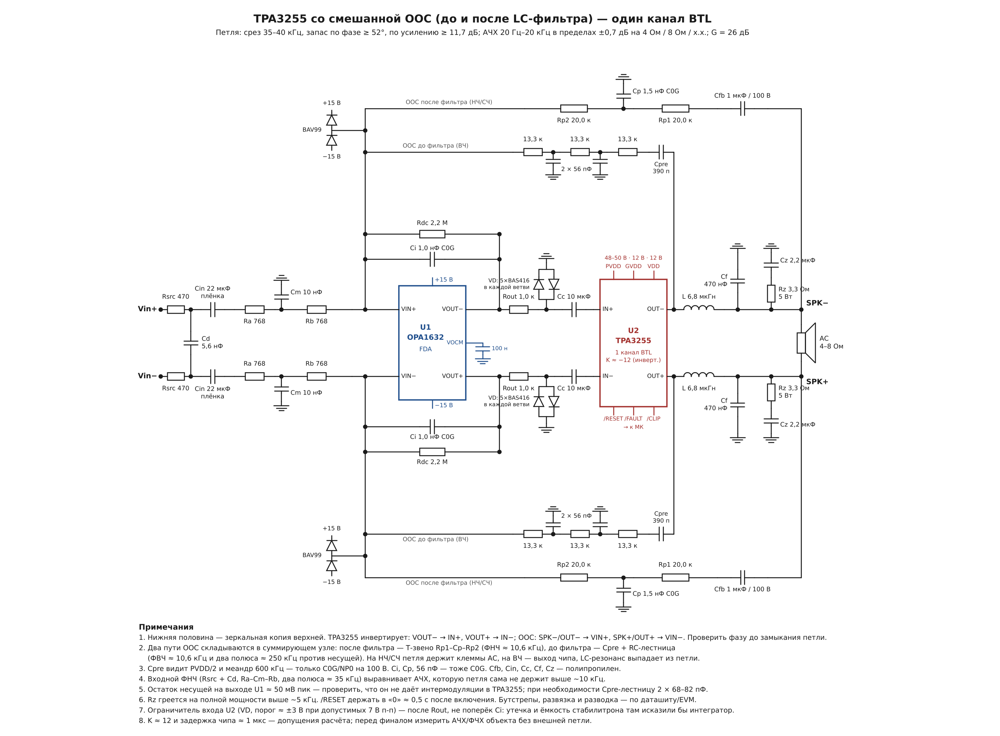

# TPA325x — внешняя обратная связь для TPA3255

Расчёт и схемы внешней петли ООС вокруг TPA3255 (один канал BTL) на дифференциальном
интеграторе OPA1632. Два варианта:

| | Только после фильтра (PFFB) | Смешанная ООС (до + после LC) |
|---|---|---|
| Схема | [`docs/pffb/pffb_schematic.pdf`](docs/pffb/pffb_schematic.pdf) | [`docs/blended/tpa3255_blend_schematic.pdf`](docs/blended/tpa3255_blend_schematic.pdf) |
| Диаграммы Боде | [`docs/pffb/pffb_bode.png`](docs/pffb/pffb_bode.png) | [`docs/blended/pffb_blend_bode.png`](docs/blended/pffb_blend_bode.png) |
| Срез петли | 22–34 кГц | 33–39 кГц |
| Запас по фазе / усилению | ≥ 67° / ≥ 9,3 дБ | ≥ 52° / ≥ 12,1 дБ |
| Глубина ООС 1к / 5к / 10к / 20к | 26 / 12 / 7 / 1–2,5 дБ | 33 / 19–20 / 13–14 / 5–7 дБ |
| АЧХ 20 Гц–20 кГц (4 Ом / 8 Ом / х.х.) | −2,3…0 дБ | −0,7…+0,7 дБ |

Рекомендуемый вариант — **смешанная ООС**.

## Общие параметры

- Усиление усилителя: 26 дБ (G = 20), вход дифференциальный.
- Выходной фильтр: L = 6,8 мкГн, C = 470 нФ на плечо (f₀ ≈ 89 кГц); Zobel 3,3 Ом / 2,2 мкФ.
- Интегратор: OPA1632 (FDA), ±15 В; Ci (C0G) ‖ Rdc 2,2 МОм, без ограничителя поперёк Ci.
- Выход интегратора → Rout 1,0 кОм → ограничитель на землю → Cc 10 мкФ → вход TPA3255 (Rвх 20 кОм).
- Защита суммирующих узлов: BAV99 на шины ±15 В.

## Смешанная ООС — как работает

Два пути ООС складываются в суммирующем узле интегратора:

- **после фильтра** (клеммы АС): Cfb 1 мкФ → Т-звено 20,0 к – 1,5 нФ – 20,0 к, ФНЧ ≈ 10,6 кГц;
- **до фильтра** (вывод OUT чипа): Cpre 390 пФ C0G/100 В → RC-лестница 3 × 13,3 к, 2 × 56 пФ
  (ФВЧ ≈ 10,6 кГц и два полюса ≈ 250 кГц против несущей).

Их сумма равна 1/Rfb, поэтому на НЧ и СЧ петля держит напряжение на клеммах АС, а на ВЧ — выход чипа,
и резонанс LC-фильтра выпадает из петли. Входной ФНЧ (Rsrc 470 + Cd 5,6 нФ; Ra 768 – Cm 10 нФ – Rb 768,
два полюса ≈ 35 кГц) выравнивает АЧХ выше ~10 кГц, где петля сама её уже не держит.

## Полярность

**TPA3255 — инвертирующий усилитель.** Поэтому VOUT− интегратора подключается к IN+ чипа, VOUT+ к IN−,
а ООС заводится так: SPK−/OUT− → VIN+, SPK+/OUT+ → VIN−. Петля получается отрицательной, а
усилитель в целом — неинвертирующим. Перед замыканием петли фазу нужно проверить на реальной плате:
разомкнуть Cfb и Cpre, подать 1 кГц и убедиться, что SPK− в противофазе с узлом VIN+.

## Ограничитель входа TPA3255

По даташиту вход TPA3255 допускает не более 7 В пик-пик (INPUT_x: −0,3…7 В, Rвх 20 кОм). При клиппинге
интегратор уходит к рельсу ±13 В, поэтому вход чипа ограничивается: после Rout 1,0 кОм на землю стоят
две встречные цепочки по 5 диодов малой утечки (BAS416 или аналог), порог ≈ ±3 В при рабочих ±2 В.

Ограничитель **не ставится поперёк Ci**. Низковольтный стабилитрон (BZX84-C3V0: утечка до 10 мкА при 1 В,
ёмкость до 450 пФ) там оказывается параллельно интегратору: его утечка сопоставима с током через Ci = 1 нФ
на звуковых частотах, а ёмкость нелинейна — петлевое усиление на НЧ модулировалось бы сигналом.
После Rout узел низкоомный, и те же паразиты дают ошибку в доли милливольта в прямом тракте, которую
подавляет петля. Деление Rout / Rвх (−0,4 дБ) учтено в расчёте. Windup интегратора при Ci = 1 нФ
отрабатывается за ~10 мкс.

## Допущения и что проверить

- Модель чипа: усиление K ≈ 12 и чистая задержка ≈ 1 мкс. Задержка TI не публикуется — это главное
  допущение расчёта. Перед изготовлением платы стоит измерить АЧХ/ФЧХ «вход чипа → вывод OUT» на
  10–150 кГц без внешней петли и пересчитать.
- Остаток несущей на выходе FDA в смешанном варианте ≈ 50 мВ пик — проверить, что он не даёт
  интермодуляции в модуляторе TPA3255.
- Rz (Zobel) греется на полной мощности синусом выше ~5 кГц — ВЧ-тесты на пониженном уровне.
- /RESET держать в «0» ≈ 0,5 с после включения, пока заряжаются Cfb и Cin.
- Бутстрепы, развязка PVDD/GVDD и разводка — по даташиту и EVM.
- Двойной интегратор посчитан и не рекомендуется: вместе с Rdc он даёт резонанс петли около 270 Гц
  с фазой до −165° (условная устойчивость, риск срыва на клиппинге).

## Скрипты (`sim/`)

Python 3 + numpy + matplotlib. Запускать из каталога `sim/`, результаты пишутся туда же.

| Скрипт | Что делает |
|---|---|
| `bode.py` | Модель петли PFFB, сравнение одинарного и двойного интегратора |
| `bode_final.py` | Диаграммы Боде для рекомендованного варианта PFFB (`pffb_bode.png`) |
| `final_blend.py` | Смешанная ООС на реальных RC-цепях: запасы, глубина ООС, АЧХ (`pffb_blend_bode.png`) |
| `tune.py` | Перебор номиналов для смешанной ООС |
| `sch.py`, `sch2.py` | Рисуют схемы PFFB и смешанной ООС (PNG/PDF) |

## Ссылки

- TI, [SLAA788 — TPA324x and TPA325x Post-Filter Feedback](https://www.ti.com/lit/pdf/slaa788)
- TI E2E: [TPA3255 — инвертирующий усилитель](https://e2e.ti.com/support/audio-group/audio/f/audio-forum/1474385/tpa3255-phase-shift)
- TI E2E: [работа TPA3255 на высоких частотах](https://e2e.ti.com/support/audio-group/audio/f/audio-forum/682649/tpa3255-high-frequency-operation)
